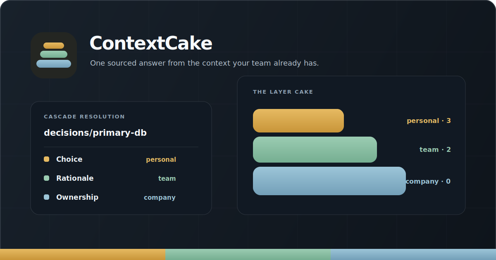

<p align="center">
  <a href="https://contextcake.com">
    
  </a>
</p>

<h1 align="center">ContextCake</h1>

<p align="center">
  <strong>One sourced answer from the context your team already has.</strong><br />
  ContextCake resolves company policy, team practice, and personal judgment into an effective knowledge graph for people and AI agents.
</p>

<p align="center">
  <a href="https://github.com/ContextCake/context-cake/actions/workflows/ci.yml"></a>
  <a href="https://nodejs.org/"></a>
  <a href="LICENSE"></a>
  <a href="https://modelcontextprotocol.io/"></a>
</p>

<p align="center">
  <a href="https://contextcake.com">Website</a> ·
  <a href="https://contextcake.com/demo">Live demo</a> ·
  <a href="https://contextcake.com/docs">Documentation</a> ·
  <a href="#quick-start">Quick start</a> ·
  <a href="CONTRIBUTING.md">Contributing</a>
</p>

<p align="center">
  
</p>

---

## Why ContextCake?

Teams do not have one source of truth. They have an org policy, a service runbook, a team decision, and the local note that explains the exception. Flattening those into another wiki loses both the useful detail and the disagreement.

ContextCake keeps each scope separate, then resolves them at read time. The result is an answer an agent can use **with its source, date, and contradictions intact**.

| What you need | What ContextCake does |
| --- | --- |
| Local nuance without copying every policy | Higher-priority layers override only the sections they address. Everything else inherits. |
| An AI agent that can explain its answer | Returns provenance for frontmatter and every resolved section. |
| A safe view of disagreement | Keeps competing values as dated conflicts instead of silently deleting them. |
| Knowledge from more than one system | Combines local [OKF](https://github.com/GoogleCloudPlatform/knowledge-catalog/blob/main/okf/SPEC.md) bundles with trusted MCP sources. |

## The layer cake

Context lives in separate repositories or directories. Repository membership remains the access-control model: ContextCake only reads the sources you configure locally.

```text
┌─────────────────────────────────────────────────────────────┐
│ Personal · level 3  Your drafts, notes, and local overrides │
├─────────────────────────────────────────────────────────────┤
│ Team     · level 2  Runbooks, decisions, and system docs    │
├─────────────────────────────────────────────────────────────┤
│ Company  · level 0  Organization-wide canonical knowledge   │
└─────────────────────────────────────────────────────────────┘
                          ↓ resolve at read time
              one effective, sourced answer for an agent
```

Resolution is **section-by-section**, not whole-document replacement. A team can override the database choice while inheriting the company backup policy.

```markdown
<!-- company/decisions/primary-db.md -->
## Engine {#engine}
Postgres.

## Backups {#backups}
Nightly snapshots to cold storage.

<!-- team/decisions/primary-db.md -->
## Engine {#engine}
SingleStore (chosen for HTAP workloads).
```

```text
Effective concept
  Engine   → SingleStore   (team wins; company value remains a dated conflict)
  Backups  → Nightly snapshots to cold storage.   (inherited from company)
```

Learn the model in more depth: [layer cake](https://contextcake.com/docs/concepts/layer-cake), [merge semantics](https://contextcake.com/docs/concepts/merge-semantics), and [conflicts and provenance](https://contextcake.com/docs/concepts/conflicts-and-provenance).

## Quick start

**Prerequisite:** [Node.js 18+](https://nodejs.org/). The core has no runtime npm dependencies, install scripts, or network fetches.

```bash
git clone https://github.com/ContextCake/context-cake.git
cd context-cake

# Resolve the bundled three-layer example as JSON.
node resolver.mjs \
  --manifest apps/playground/manifest.json \
  --concept decisions/primary-db

# Open the visual playground at http://127.0.0.1:8790.
npm run playground
```

Want a verified walkthrough instead? This prepares a deliberate disagreement across company, team, and personal layers, then proves inheritance, conflicts, and provenance end to end.

```bash
npm run demo:verify
```

Next: [build your first cascade](https://contextcake.com/docs/getting-started/first-cascade) or [open the live demo](https://contextcake.com/demo).

## Connect an AI agent

ContextCake serves the resolved graph over the [Model Context Protocol](https://modelcontextprotocol.io/) (MCP). Point any stdio MCP client at a manifest you trust:

```bash
node mcp-server.mjs --manifest apps/playground/manifest.json
```

For Claude Code, use absolute paths because MCP clients launch servers from their own working directory:

```bash
claude mcp add contextcake -- \
  node /ABSOLUTE/PATH/context-cake/mcp-server.mjs \
  --manifest /ABSOLUTE/PATH/context-cake/apps/playground/manifest.json
```

The server exposes a small, read-focused interface:

| Tool | Use it to |
| --- | --- |
| `search` | Find concepts across every configured layer. |
| `read_file` | Read the effective concept, including section provenance and conflicts; pass `layer` for the raw source concept. |
| `list_concepts` | Discover effective concept IDs, optionally filtered by type. |
| `get_links` | Traverse incoming and outgoing links in the effective graph. |

See the [agent connection guide](https://contextcake.com/docs/getting-started/connect-an-agent) and complete [MCP tools reference](https://contextcake.com/docs/reference/mcp-tools).

> [!CAUTION]
> A manifest is a trust boundary. An `mcp` source may start the `command` named in that manifest with your user privileges. Only run manifests and configure sources you trust. Read the [trust-boundary guide](https://contextcake.com/docs/concepts/trust-boundary) before connecting external sources.

## Bring your own knowledge

A manifest defines the sources and their precedence. Local `okf-local` sources are Markdown directories with YAML frontmatter; an MCP source translates a trusted foreign graph into the same resolved view.

```json
{
  "layers": [
    {
      "name": "personal",
      "level": 3,
      "source": "okf-local",
      "path": "~/kb-personal"
    },
    {
      "name": "team",
      "level": 2,
      "source": "okf-local",
      "path": "~/kb-team"
    },
    {
      "name": "company",
      "level": 0,
      "source": "mcp",
      "command": "node",
      "args": ["./company-graph-server.mjs"]
    }
  ]
}
```

```markdown
---
type: decision
title: Primary database
updated: 2026-07-15
---

## Engine {#engine}

Postgres.
```

Only `type` is required for a local OKF concept. See the [manifest reference](https://contextcake.com/docs/reference/manifest), [OKF bundle guide](https://contextcake.com/docs/concepts/okf-bundles), and [foreign MCP source guide](https://contextcake.com/docs/guides/foreign-mcp-sources).

## Capture, review, and promote knowledge

ContextCake can turn repository activity into draft knowledge while preserving a human review point for sensitive changes.

```text
repository activity
  → classify-context.mjs
  → ingest.mjs
  → signals.json
  → write.mjs
  → OKF layer bundle
  → promote.mjs (when a personal concept should become shared)
```

- `team_candidate` signals become draft concepts in the selected layer.
- `review_required` signals are staged under `_review/` for approval.
- `ignore` and `local` signals are not written to the shared layer.

```bash
# Create demo signals, inspect what would be written, then write deliberately.
node ingest.mjs --demo
node write.mjs \
  --signals apps/control-surface/signals.json \
  --manifest apps/playground/manifest.json \
  --target-layer team \
  --dry-run
```

Read the [capture/write-path guide](https://contextcake.com/docs/guides/capture-write-path) and [promotion guide](https://contextcake.com/docs/guides/promoting-concepts).

## Project surfaces

| Surface | Purpose | Start here |
| --- | --- | --- |
| `packages/core/` | Dependency-free resolver, source adapters, MCP server, and write path | [Architecture](docs/architecture/README.md) |
| `apps/playground/` | Local interactive explorer for a cascade | [`npm run playground`](apps/playground/README.md) |
| `apps/console/` | React + Vite console for inspecting a resolved graph | [Console README](apps/console/README.md) |
| `apps/desktop/` | macOS desktop shell around the same engine | [Desktop README](apps/desktop/README.md) |
| `apps/site/` | Public website and documentation | [Documentation](https://contextcake.com/docs) |

The site, console, and core release independently. For the precise meaning of `merged`, `preview`, and `live` on each surface, see [Go Live](docs/go-live.md).

## Development and validation

The root engine deliberately has no install step. The console, site, and desktop app manage their own dependencies and lockfiles.

```bash
# Core engine, MCP, sources, write path, and playground integration
npm test

# Console
npm --prefix apps/console ci
npm --prefix apps/console run typecheck
npm --prefix apps/console test
npm --prefix apps/console run build

# Public site
npm --prefix apps/site ci
npm --prefix apps/site run build
```

`npm test` starts a local playground server, so it requires an environment that allows binding to `127.0.0.1`. See [CONTRIBUTING.md](CONTRIBUTING.md) for repository conventions, validation expectations, and issue labels.

## Documentation map

- [Getting started](https://contextcake.com/docs/getting-started/installation) — obtain the source archive, verify it, and make a first cascade.
- [Concepts](https://contextcake.com/docs/concepts/layer-cake) — layers, merge rules, provenance, conflicts, and the trust boundary.
- [Reference](https://contextcake.com/docs/reference/cli) — CLI flags, manifests, MCP tools, and override syntax.
- [Architecture](docs/architecture/README.md) — decisions, diagrams, and the resolver design.
- [Security policy](SECURITY.md) — responsible disclosure and supported-version policy.

## Contributing

Contributions are welcome. Before opening a pull request, please read [CONTRIBUTING.md](CONTRIBUTING.md), keep `packages/core/` dependency-free, and run the checks relevant to the surface you changed. For security issues, use [private vulnerability reporting](https://github.com/ContextCake/context-cake/security/advisories/new) rather than a public issue.

## License

ContextCake is released under the [MIT License](LICENSE).
